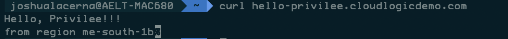
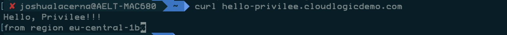
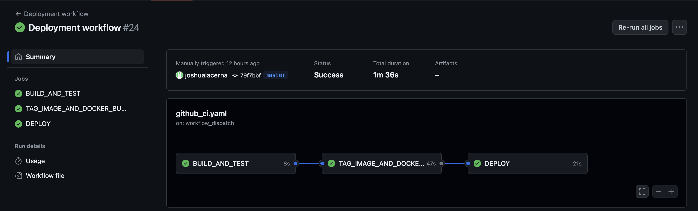
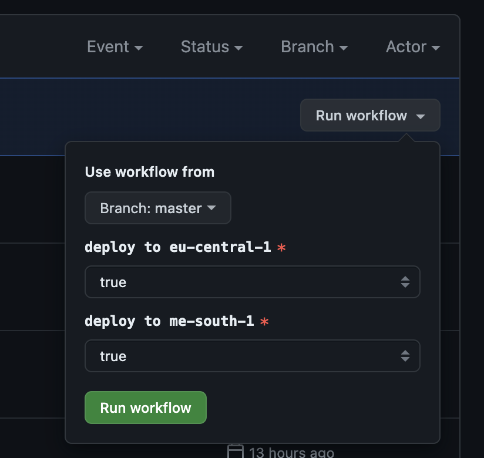
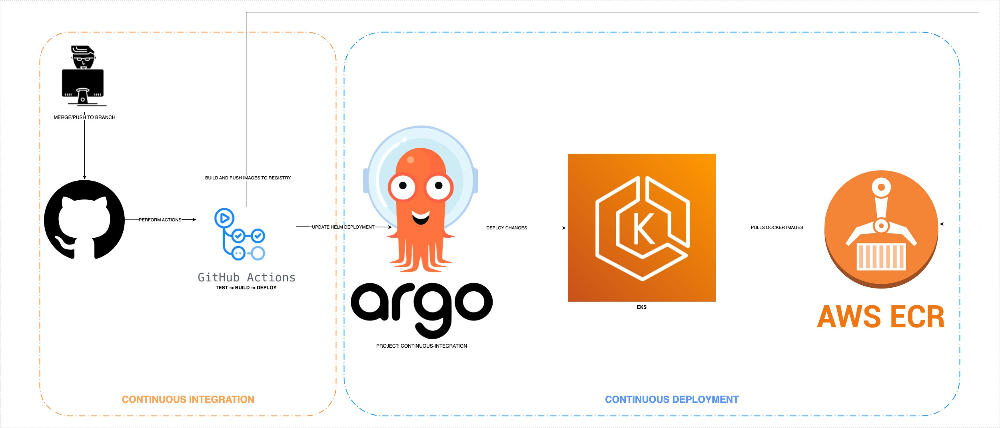

# **Hello Privilee** (DevOps Challenge)


### **GitHub Workflow (CICD)**

1) The first part of the challenge is to build a GitHub actions workflow to build the application and run the tests.
2) Update the workflow to deploy the application to EKS with the following jobs structure: build → test → deploy


### **Deployment**

Utilise Infrastructure as Code (IaC) tools such as CloudFormation or Terraform to automate the creation of the infrastructure needed to deploy this application in Bahrain. (Choose one of these options: EC2, ECS, EKS, Lambda). Assume any missing information necessary for making a decision and document your choices in a README file.


### **Context**

Considering the Hello Privilee application is a backend application that will provide a list of API endpoints for a mobile application.
- The application is deployable in different countries
- The application should handle the peak usage happening during weekend evenings (3x)
- The application should be protected against brute force attacks
- The application should be deployed without downtime (choose any deployment strategy)


### **Misc**

How to run tests in the application?
```sh
// Run the tests
go test
```

How to run the application?
```sh
// Run the app
go mod tidy && go run hello-privilee
```


### **Delivery**
Upload your solution to GitHub, Bitbucket or any Git repository that is publicly accessible and email the recruiter you are dealing with providing a link to the repository.

# Application

Hi, you can now access privilee demo golang service on this endpoint: [hello-privilee.cloudlogicdemo.com](hello-privilee.cloudlogicdemo.com)

The service is deployed in TWO regions which are **me-south-1 (Bahrain)** and **eu-central-1 (Frankfurt)**.




I added a little script and code to return the current container/pod region.

I have used **KUBERNETES** as an underlying container orchestration server for this application.

Infrastructure tools associated with the application:

```KUBERNETES : Orchestration tool 
ROUTE53 : DNS and Routing
ARGOCD : Kubernetes application management AND Deployment
TRAEFIK : Ingress Controller or Reverse Proxy
```


# WORKFLOWS



We also have the option on wether to deploy the application to specific region.



The worflow steps are:

```BUILD_AND_TEST ---> TAG_IMAGE_AND_DOCKER_BUILD ---> DEPLOY```

BUILD_AND_TEST: will locally build the image and perform testing.

TAG_IMAGE_AND_DOCKER_BUILD: if the first step is successful it will do the docker build and docker push to repository.

DEPLOY: will deploy the application service in **KUBERNETES**.

Example of a worflow run: 

https://github.com/joshualacerna/privilee-demo/actions/runs/8621203594

### APPLICATION INFRASTRUCTURE



# Infrastructure

There is a terraform repo used to deploy the underlying infrastructure for both regions.

Visit this [repository](https://github.com/joshualacerna/privilee-demo-infrastructure) for the IAC code **(TERRAFORM)**  infrastruture.

# Helm Chart Templates for Go in Kubernetes

This project provides template Helm Charts for deploying a GO web application into any Kubernetes based cloud.

The templates require your application to built into a Docker image.

This project provides the following files:

| File                                              | Description                                                             |
|---------------------------------------------------|-------------------------------------------------------------------------|  
| `/chart/Chart.yaml`                               | The definition file for your application                                | 
| `/chart/values.yaml`                              | Configurable values that are inserted into the following template files | 
| `/chart/templates/deployment.yaml`                | Template to configure your application deployment.                      | 
| `/chart/templates/service.yaml`                   | Template to configure your application deployment service.              | 
| `/chart/templates/serviceaccount.yaml`            | Template to configure your application deployment service account.      | 
| `/chart/templates/hpa.yaml`                       | Template to configure your application deployment auto scaling.         | 
| `/chart/templates/ingress.yaml`                   | Template to configure your application traefik ingress deployment.      | 
| `/chart/templates/NOTES.txt`                      | Helper to enable locating your application IP and PORT                  | 

In order to use these template files, copy the files from this project into your application directory. You should only need to edit the `Chart.yaml` and `values.yaml` files.

## Prerequisites

Using the template Helm charts assumes the following pre-requisites are complete:  

1. You have a Kubernetes cluster  
  This could be one hosted by a cloud provider or running locally, for example using [Minikube](https://kubernetes.io/docs/setup/minikube/)
  
2. You have kubectl installed and configured for your cluster  
  The [Kuberenetes command line](https://kubernetes.io/docs/tasks/tools/install-kubectl/) tool, `kubectl`, is used to view and control your Kubernetes cluster.

3. You have the Helm command line and Tiller backend installed  
   [Helm and Tiller](https://docs.helm.sh/using_helm/) provide the command line tool and backend service for deploying your application using the Helm chart.
   These charts are compatible with Helm v2 and v3

4. You have created and published a Docker image for your application  
The Docker Template project provides guidance on [building a run image](https://github.com/CloudNativeJS/docker#using-dockerfile-tools) for your application and [publishing it to the DockerHub registry](https://github.com/CloudNativeJS/docker#publishing-the-image).

5. Your application has a "health" endpoint  
  This allows Kubernetes to restart your application if it fails or becomes unresponsive. The [Health Connect](https://github.com/CloudNativeJS/cloud-health-connect) middleware can be used to add a health endpoint.

## Adding the Chart to your Application

In order to add Helm Charts to your application, Using hel generate the `chart` into your application's root directory.

You then need to make a single change before the charts are usable: to set the `image.repository` for your application.

### Setting the `image.repository` parameter

In order to change the `image.repository` parameter, open the `charts/values.yaml` file and change the following entry:  

```sh
image:
  repository: privilee-demo-golang(repository)...
```
to set `<namespace>` to your namespace on DockerHub where you published your application as `privilee-demo-golang`.

## Configuring the Chart for your Application

The following table lists the configurable parameters of the template Helm chart and their default values.

| Parameter                  | Description                                     | Default                                                    |
| -----------------------    | ---------------------------------------------   | ---------------------------------------------------------- |
| `image.repository`         | image repository                                | `privilee-demo-golang(repository)...`                      |
| `image.tag`                | Image tag                                       | `latest`                                                   |
| `image.pullPolicy`         | Image pull policy                               | `Always`                                                   |
| `service.name`             | Kubernetes service name                         | `Node`                                                     |
| `service.type`             | Kubernetes service type exposing port           | `NodePort`                                                 |
| `service.port`             | TCP Port for this service                       | 3000                                                       |
| `resources.limits.memory`  | Memory resource limits                          | `128m`                                                     |
| `resources.limits.cpu`     | CPU resource limits                             | `100m`                                                     |

#### Liveness and Readiness Probes

With the default configuration, no liveness or readiness is enabled. This means that the container is considered healthy as long as its main process is running, otherwise it's considered a failure.

Optionally, you add configurations for readiness and liveness probes by configuring `image.readinessProbe` and `image.livenessProbe` parameters, respectively. Example configuration is provided in the `values.yaml` file.

The `initialDelaySeconds` defines how long to wait before performing the first probe. Default value for readiness probe is 2 seconds and for liveness probe is 20 seconds. You should set appropriate values for your container, if necessary, to ensure that the readiness and liveness probes don’t interfere with each other. Otherwise, the liveness probe might continuously restart the pod and the pod will never be marked as ready.

More information about configuring liveness and readiness probes can be found [here](https://kubernetes.io/docs/tasks/configure-pod-container/configure-liveness-readiness-probes/)


## Using the Chart to deploy your Application to Kubernetes

In order to use the Helm chart to deploy and verify your application in Kubernetes, run the following commands:

1. From the directory containing `Chart.yaml`, run:  

  **Helm v2**
  
  ```sh
  helm install --name privilee-demo-golang .
  ```

  **Helm v3**
  
  ```sh
  helm install privilee-demo-golang .
  ```

  This deploys and runs your application in Kubernetes, and prints the following text to the console:  
  
  ```sh
  Congratulations, you have deployed your GO Application to Kubernetes using Helm!

  To verify your application is running, run the following two commands to set the SAMPLE_NODE_PORT and SAMPLE_NODE_IP environment variables to the location of your application:

  export SAMPLE_NODE_PORT=$(kubectl get --namespace default -o jsonpath="{.spec.ports[0].nodePort}" services privilee-demo-golang-service)
  export SAMPLE_NODE_IP=$(kubectl get nodes --namespace default -o jsonpath="{.items[0].status.addresses[0].address}")
  
  And then open your web browser to http://${SAMPLE_NODE_IP}:${SAMPLE_NODE_PORT} from the command line, eg:
  
  open http://${SAMPLE_NODE_IP}:${SAMPLE_NODE_PORT}
  ```
  
2. Copy, paste and run the `export` lines printed to the console
  eg:
  
  ```sh
  export SAMPLE_NODE_PORT=$(kubectl get --namespace default -o jsonpath="{.spec.ports[0].nodePort}" services privilee-demo-golang-service)
  export SAMPLE_NODE_IP=$(kubectl get nodes --namespace default -o jsonpath="{.items[0].status.addresses[0].address}")
  ```
  
3. Open a browser to view your application:  
  Open your browser to `http://${SAMPLE_NODE_IP}:${SAMPLE_NODE_PORT}` from the command line using:
  
  ```sh
  open http://${SAMPLE_NODE_IP}:${SAMPLE_NODE_PORT}
  ```

You application should now be visible in your browser.


## Uninstalling your Application
If you installed your application with:  

**Helm v2**

```sh
helm install --name privilee-demo-golang .
```
then you can:

* Find the deployment using `helm list --all` and searching for an entry with the chart name "privilee-demo-golang".
* Remove the application with `helm delete --purge privilee-demo-golang`.

**Helm v3**

```sh
helm install privilee-demo-golang .
```
then you can:

* Find the deployment using `helm list --all` and searching for an entry with the chart name "privilee-demo-golang".
* Remove the application with `helm uninstall privilee-demo-golang`.


